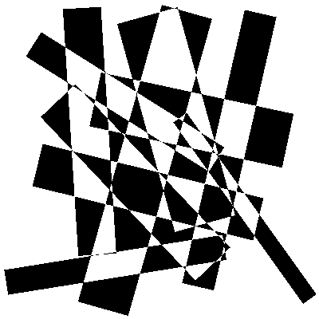
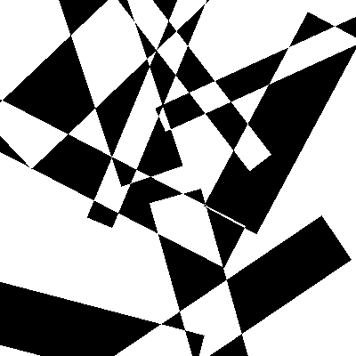

# Alternate Fillings
Alternate Fillings is a pattern found on the doors between two train compartments. It is built up of rectangles, where each overlapping rectangle inverts the color of the overlapped region. 

The code in this repository creates similar filling patterns. The algorithm is designed such that the rectangles are visually pleasing. The user of this code can play around with the configuration for different results. Below two example drawings with 10 rectangles, with either all rectangles completely inside the canvas or not respecitvely.




## Execution notes

To run the code, run the following from the `src` folder:
```shell script
python alternate_fillings
```

Running the code requires Python 3.6 or up.

## Efficiency notes

### The algorithm is quadratic in canvas size

The following timings are averages of three drawings with 10 rectangles with varying CANVAS_SIZE.

| CANVAS_SIZE | Time in seconds |
|:-----------:|:---------------:|
|     100     |        3.0      |
|     200     |        3.6      |
|     400     |       15.8      |
|     800     |       62.7      |

### The algorithm is linear in number of rectangles

The following timings are averages of three drawings with CANVAS_SIZE of 400 with varying number of rectangles.

| NR_RECTANGLES | Time in seconds |
|:-------------:|:---------------:|
|       5       |       13.2      |
|       10      |       23.2      |
|       20      |       27.4      |
|       40      |       50.8      |
|       80      |       99.2      |